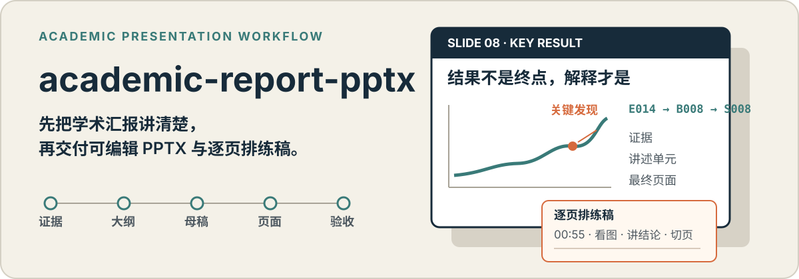

<p align="center">
  
</p>

<p align="center">
  <strong>模板优先 · 证据可追溯 · 对象级可编辑 · PPTX 与讲稿成套交付</strong>
</p>

`academic-report-pptx` 是一个面向真实学术汇报的 Codex Skill。它不会把论文摘要切成一组看似完整的卡片，而是先确定汇报目标和讲述逻辑，再沿用用户的专属模板制作可编辑 PPTX，并交付与最终页码对应的排练稿。

适用于文献汇报、journal club、组会、研究进展、开题、答辩、会议和研讨会报告，也可以修复已有学术 PPTX 的 AI 感、模板残留和不可编辑问题。

## 立即使用

```text
npx skills add Quicklime555/academic-report-pptx
```

重新启动会话并确认 Skill 已加载，然后直接提供原始材料、汇报要求和模板：

```text
参考学校给的答辩模板，把我的论文和实验图做成 15 分钟中文答辩 PPTX。
先让我确认内容大纲，再写口头汇报母稿，最后制作可编辑 PPTX；
事实要可核对，并同步交付与最终页码对应的排练稿。
```

核心 Skill 不需要 API key。宿主需要具备创建、编辑、渲染和重新打开原生 PPTX 的能力；在 Codex 中推荐搭配已安装的 `ppt-master`。

## 最终得到什么

- **可继续编辑的 PPTX**：普通文字、形状、表格和可重建图表尽量保留为原生对象，不用整页图片伪装成 PPTX。
- **与成品逐页对齐的排练稿**：包含页码、预计时间、视觉关注点、讲述内容和切页提示，可直接拿来排练。
- **经确认的内容中间件**：包括内容大纲与完整口头母稿，便于在做视觉设计前纠正叙事方向。
- **可复查的 QA 记录**：覆盖内容、对象、渲染结果和旧模板残留，而不只检查文件能否打开。

## 它为什么不同

### 先写“怎么讲”，再决定“怎么分页”

大纲先确认观点顺序；母稿以完整口头表达为单位，不提前被页面边界切碎；页面脚本再根据时长、认知负荷和视觉材料完成分页。这样能减少标题卡片堆叠、逐页重复和“每页都对，但整场讲不通”的问题。

### 延续你的模板，而不是套一个通用主题

Skill 会优先提取用户模板的母版、页面家族、导航、网格和排版语法，并在制作完整 deck 前确认代表页。模板不是一个配色参考，而是后续页面需要遵守的视觉系统。

### 用稳定 ID 连接事实、讲述和页面

证据 `E###`、素材 `A###`、大纲 `O###`、讲述单元 `B###` 和页面 `S###` 保持可追溯关系。数字、结论和图表可以回查来源；缺少证据时必须明确标注，而不是让模型补齐。

### PPTX 和讲稿来自同一个交付版本

最终排练稿不是制作前的泛化备注。它会在 PPTX 完成后按实际页码重新生成，因此页面顺序、讲述内容、视觉关注点和切页提示保持一致。

## 工作流

```text
汇报需求与身份
      ↓
证据台账 + 素材台账 + 模板画像
      ↓
内容大纲 → 用户确认
      ↓
口头汇报母稿 → 用户确认
      ↓
页面脚本 + 代表页 → 用户确认
      ↓
可编辑 PPTX + 逐页排练稿
      ↓
内容 QA + 渲染 QA + 对象 QA + 交付 QA
```

确认节点只放在会显著改变后续结果的位置。已经确认的叙事不会在视觉制作阶段被静默改写；如果证据、时长或模板条件变化，流程会回到相应阶段重新校验。

## 更多使用方式

```text
沿用这个实验室模板，把阶段结果扩成组会汇报。
不要整页图片，图表和文字必须可编辑。
```

```text
检查这份已有答辩 PPTX：保留学校模板语言，减少 AI 感，
修复遮挡、旧内容残留和不可编辑图表，并补齐逐页排练稿。
```

```text
先根据论文和 15 分钟要求给我内容大纲；确认后写成口头汇报母稿，
最后再沿用学校模板制作可编辑答辩 PPTX。
```

## 质量约束

| 检查对象 | Skill 会确认什么 |
| --- | --- |
| 内容 | 关键结论有来源，数字与限定条件没有被改写，必讲内容已覆盖 |
| 叙事 | 大纲、母稿、页面脚本之间可映射，时长与页面密度合理 |
| 模板 | 代表页已确认，页面家族与排版语法一致，没有旧模板内容残留 |
| 对象 | 文本、表格、图表和形状尽量原生可编辑，不存在隐藏越界对象 |
| 渲染 | 逐页检查遮挡、裁切、乱码、留白失衡和跨页跳变 |
| 交付 | PPTX 可重新打开，页码和排练稿一致，最终文件记录完整性信息 |

仓库包含确定性的流程校验与 PPTX 对象审计脚本；这些检查可以发现结构性问题，但不能代替人工对学术结论和最终审美的判断。

## 输出文件

面向使用者的核心交付：

```text
final-presentation.pptx
rehearsal-script.md
content-outline.md
talk-manuscript.md
qa-report.md
```

任务目录还会保留内部 `slide-plan.md`、`report-spec.json`、流程校验 JSON、逐页渲染图、contact sheet 和 PPTX 对象审计 JSON，便于复查和继续修改。

## 兼容性与边界

- 已验证：Windows 11、Codex、本地 Python 3.12、原生 PPTX 工作流。
- `scripts/audit_pptx.py` 只使用 Python 标准库；其他平台理论可运行，但尚未完成实际验证。
- 实际 PPTX 制作和渲染依赖宿主能力；只有整页图片生成能力时，无法满足本 Skill 的核心承诺。
- 本机脚本不会主动上传材料；是否联网、数据是否离开本机，取决于宿主实际采用的 PPTX 制作能力。
- 不用于论文批注或笔记管理、无 PPT 的论文总结、常规教学课件、营销或融资演示、纯图片幻灯片，以及只做审美点评而不实施 PPTX 修改的任务。

## 验证与开发状态

```text
python scripts/audit_pptx.py --self-test
python scripts/validate_pipeline.py <report-spec.json> --stage delivery --strict
python -m unittest discover -s tests -v
```

效果评测样例位于 `evals/evals.json`。当前版本已通过仓库单元测试与严格静态校验，但仍以作者自测为主；尚未完成隔离执行者测试和用户盲评，因此不把静态通过等同于审美效果证明。

## License

[MIT](./LICENSE)
